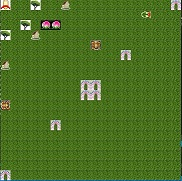
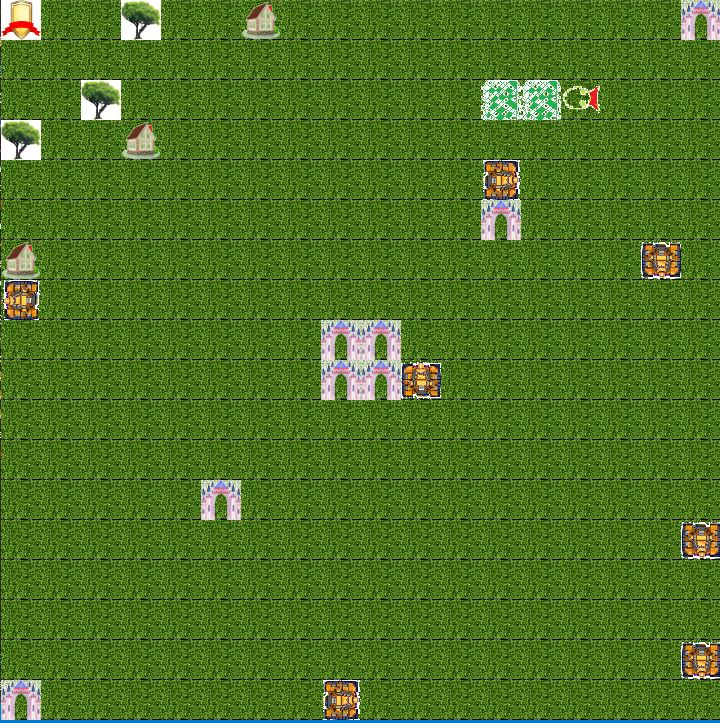

# 贪吃蛇大战坦克

## 玩法说明
* 本游戏结合了植物大战僵尸、贪吃蛇、坦克大战等多种游戏元素。  
* 按上下左右键控制方向
* 若所按方向键与运动方向相同，发射炮弹，每发射一发炮弹消耗一节身体
* G：种树，grow，树上会长桃子，每种一棵树消耗一节身体
* H：盖房子，house，房子可以抵御坦克的子弹，每盖一所房子消耗一节身体
* 吃桃子：每吃一个桃子长一节身体
* 桃子都是树上长得，以一定的概率随机在树周围长桃子，所以种树不能太稠密，这样树才能结出桃子
* 坦克之源是坦克的造血干细胞，一切坦克都是从坦克之源冒出来的。我们的目的就是消灭全部的坦克之源。
* 生命之源是你需要保护的对象，如果生命之源被攻破，那么游戏结束。
* 子弹不长眼睛，坦克发出的子弹也可以打坦克
* 憋死现象：贪吃蛇自己会憋住自己，结果就是自己无法动弹；坦克也会被憋住，结果就是坦克死亡
* 发射子弹：只有两个物体距离大于一才可以发射子弹。
